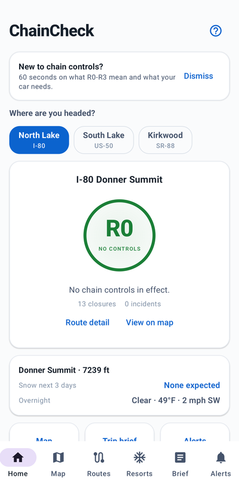
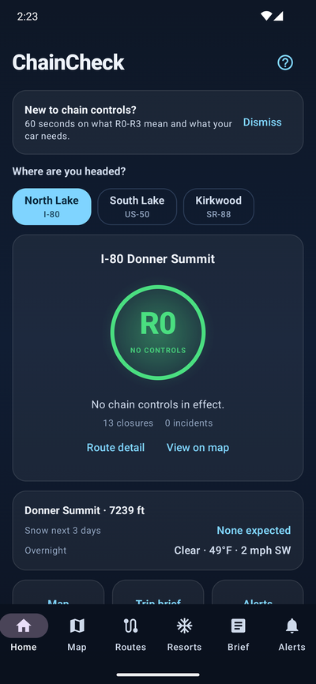
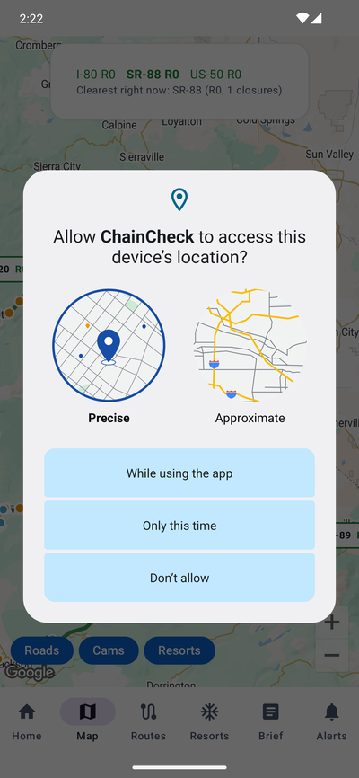
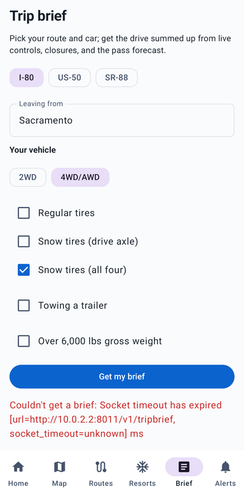
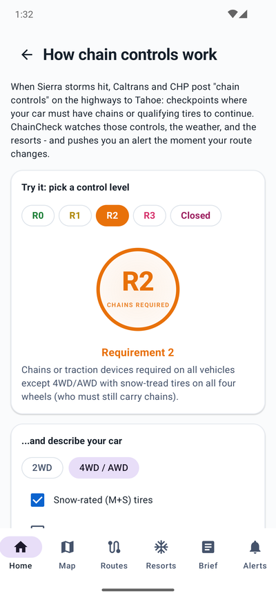
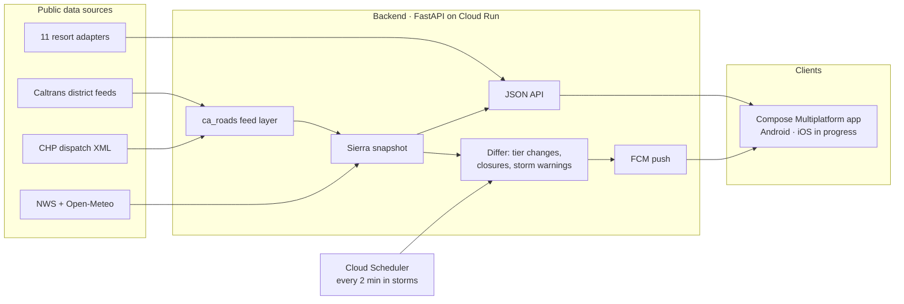

<div align="center">
  

  <h1>ChainCheck</h1>

  <p><b>Live chain controls, closures, pass weather, and resort snow for the Tahoe passes.</b></p>

  <p>
    <a href="https://github.com/nicglazkov/chaincheck/releases/latest"></a>
    <a href="https://github.com/nicglazkov/chaincheck/actions/workflows/ci.yml"></a>
    
    <a href="LICENSE"></a>
  </p>

  <p>
    <a href="https://github.com/nicglazkov/chaincheck/releases/latest/download/chaincheck.apk"></a>
    
    
  </p>

  <p>
    <a href="#install-it"><b>Install</b></a> ·
    <a href="#screenshots">Screenshots</a> ·
    <a href="#what-it-does">Features</a> ·
    <a href="#how-it-works">Architecture</a> ·
    <a href="#run-it-locally">Quickstart</a> ·
    <a href="#api">API</a> ·
    <a href="#tests-and-evals">Tests</a> ·
    <a href="#data-sources-and-thanks">Data sources</a>
  </p>
</div>

---

## Screenshots

<table>
  <tr>
    <td align="center"><br><sub>Home, light theme</sub></td>
    <td align="center"><br><sub>Home, dark theme</sub></td>
    <td align="center"><br><sub>Map, colored by control level</sub></td>
    <td align="center"><br><sub>Trip brief</sub></td>
    <td align="center"><br><sub>Guide</sub></td>
  </tr>
</table>

## What it does

| Feature | Details |
|---|---|
| **Route status** | Each route's chain control level when the app opens: R0 to R3 or Closed, and what it requires for the vehicle you specify |
| **Map** | Every Sierra crossing drawn on its highway geometry and colored by its current control level, with 80 Caltrans cameras, closures, CHP incidents, resorts, and passes. Tapping an item anywhere in the app opens it here |
| **Push alerts** | Watch a route and get a notification when its tier changes, a closure goes up, or a storm warning lands on its pass. Alerts cover only those three events |
| **Pass forecasts** | NWS pass forecasts and hourly snow accumulation, split into before departure and during the drive |
| **Resort snow** | 24 hour totals, base depth, and lifts open for 11 Tahoe resorts; off-season is labeled as off-season rather than reported as zero |
| **AI trip brief** | A language model writes the summary but can only restate verified facts. Each brief is validated for every active control and closure; if it fails validation, a deterministic plain-text brief is used instead |
| **Offline and glove-friendly** | Cached data with "as of" timestamps, large touch targets, and a short interactive guide for first-timers |

> [!IMPORTANT]
> **The chain rules are code, not prose.** R1, R2, and R3 vehicle requirements are
> encoded as structured logic from the published Caltrans definitions and covered by
> exhaustive unit tests. The AI presents them; it cannot alter them. And ChainCheck
> never tells you conditions are safe. That call is always yours.

## How it works



<details>
<summary><b>Backend</b> · Python 3.12, FastAPI, Cloud Run</summary>
<br>

- Road data comes from the [ca_roads](https://github.com/nicglazkov/ca-roads-mcp)
  feed layer, which parses the public Caltrans and CHP feeds with per-district
  caching, conditional GETs, and stale-serve so a flaky feed degrades instead of
  disappearing.
- Forecasts come from api.weather.gov and Open-Meteo. Both free, no keys.
- Resort conditions come from public JSON feeds where resorts have them and light
  per-resort scrapers where they do not. Each adapter fails alone, can be disabled
  by config, and reports `null` for anything unpublished rather than guessing.
- Polling is adaptive: every 2 minutes during active weather, every 15 otherwise.
  A pure differ turns snapshots into events (tier changes, closures, storm
  warnings) that fan out to watching devices over FCM. Subscriptions are anonymous
  device tokens in Firestore.
- Route lines are extracted once from OpenStreetMap way data and baked into the
  package, so the map draws real pavement with zero runtime routing cost.

</details>

<details>
<summary><b>App</b> · Kotlin, Compose Multiplatform</summary>
<br>

- One shared codebase for UI, data, and logic. Android ships first; the shared
  code already declares iOS targets.
- Two themes: "Sierra Light" for light mode and "Summit" for dark mode, with a
  high-contrast tier ring. The system setting chooses between them.
- Google Maps with a custom map style, tier-colored route polylines, and a small
  set of custom markers (ringed dots, tier pills, resort chips) rather than
  generic pins.
- The freshness line shows a live pulse and relative age ("Updated 2 min ago"),
  and switches to an amber "cached" state in dead zones.

</details>

<details>
<summary><b>AI safety design</b> · how the brief stays grounded in facts</summary>
<br>

The trip brief pipeline is fact-assembly first, narration second:

1. A pure, unit-tested function assembles everything the model may say: tier,
   every active control point, closures, alerts, forecast windows, snow split
   into before-departure and during-drive, and the vehicle ruling from the rules
   engine.
2. Claude narrates those facts only, with one retry on validation failure.
3. A validator checks the output: every active control and alert named, the
   current tier stated, no other tier mentioned, no safety promises. Anything
   that fails ships as the deterministic plain rendering instead.
4. A 25-scenario eval set runs offline in CI and against the live model on demand.

</details>

## Install it

> [!NOTE]
> **Google Play and the Apple App Store are coming in August 2026.** Until
> then, Android users can install it directly in about a minute.

**Android, right now:**

1. On your Android phone, open the [latest release](https://github.com/nicglazkov/chaincheck/releases/latest).
2. Under **Assets**, tap the `.apk` file to download it, then open it.
3. Android will ask you to allow installs from your browser the first time
   (normal for apps not yet on the Play Store). Allow it, then tap **Install**.
4. Open ChainCheck and pick your route. No account, no sign-up.

Full step-by-step, iPhone status, updating, and troubleshooting:
**[Install guide](docs/install.md)**.

By installing you agree to the [terms of use](docs/terms.md). The
[privacy policy](docs/privacy.md) is short: no accounts, no tracking,
location never leaves your phone.

## Run it locally

**Backend** (Python 3.12+, [uv](https://github.com/astral-sh/uv) recommended):

```bash
cd backend
uv venv && uv pip install -e ".[dev]"
uv run uvicorn chaincheck.api.app:app --reload
```

> [!TIP]
> The API is keyless by default. All core feeds are free and public. Set
> `ANTHROPIC_API_KEY` if you want AI-narrated trip briefs; plain-text briefs work
> without it.

**Android** (JDK 17+, Android SDK):

```bash
./gradlew :composeApp:installDebug -PchaincheckBaseUrl=http://10.0.2.2:8000
```

> [!NOTE]
> Maps need a Google Maps Android key in `local.properties` as `MAPS_API_KEY=...`
> (restrict it to your package and signing certificate). Push needs a Firebase
> project and its `google-services.json` in `composeApp/`. Both files are
> gitignored; the app builds and runs without them, minus those two features.

## API

The backend is client-agnostic JSON. The highlights:

| Endpoint | What it returns |
|---|---|
| `GET /v1/summary` | Every corridor's tier plus pass forecasts, in one call |
| `GET /v1/routes/{id}` | Control points, closures, and incidents for one corridor |
| `GET /v1/map` | Everything plottable: route geometry, controls, closures, incidents, webcams, passes, resorts |
| `GET /v1/resorts` | Snow totals, base, and lifts for 11 resorts |
| `POST /v1/rules/evaluate` | What a given vehicle must do at a given tier |
| `POST /v1/tripbrief` | The validated AI (or plain) trip brief |
| `PUT /v1/subscriptions` | Watch corridors with an FCM token |

Every data payload carries `as_of` and `stale` so clients can be honest about
freshness.

## Tests and evals

```bash
cd backend && uv run pytest              # 150 tests: feeds, rules table, differ, briefs
uv run python -m evals.run_tripbrief     # live-model eval set (needs ANTHROPIC_API_KEY)
./gradlew :composeApp:testDebugUnitTest  # app unit tests
```

CI runs the backend suite, lint, and an Android build on every pull request.

## Roadmap

- [ ] Google Play and Apple App Store releases (August 2026)
- [ ] iOS build (shared code is ready, Xcode project in progress)
- [ ] Read-only web page for sharing route status with people without the app

## Data sources and thanks

- Chain controls, lane closures, cameras: [Caltrans](https://dot.ca.gov) public district feeds
- Incidents: [CHP](https://www.chp.ca.gov) dispatch feed
- Forecasts and winter alerts: [National Weather Service](https://www.weather.gov)
- Hourly snow: [Open-Meteo](https://open-meteo.com)
- Route geometry: [OpenStreetMap](https://www.openstreetmap.org/copyright) contributors
- Resort conditions: each resort's public snow report, fetched gently and attributed in-app

> [!WARNING]
> ChainCheck is not affiliated with Caltrans, the CHP, the NWS, or any resort.
> Conditions change faster than any app. Verify before you drive: dial 511 or check
> [quickmap.dot.ca.gov](https://quickmap.dot.ca.gov). Whether it is safe to drive is
> always your decision.

## License

MIT. See [LICENSE](LICENSE).
